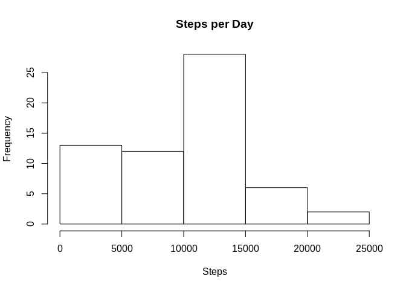
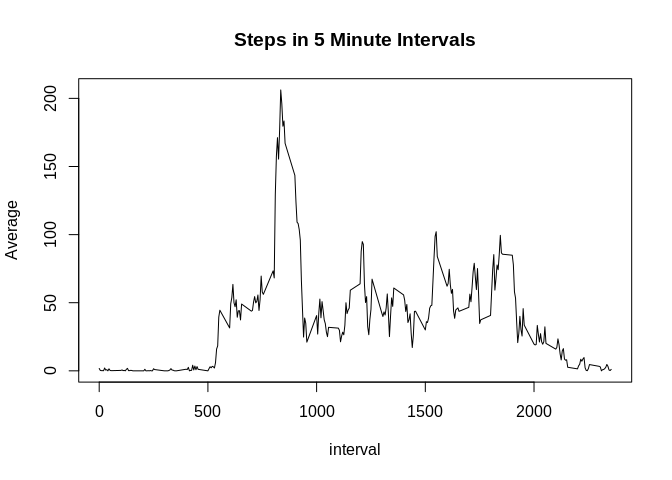
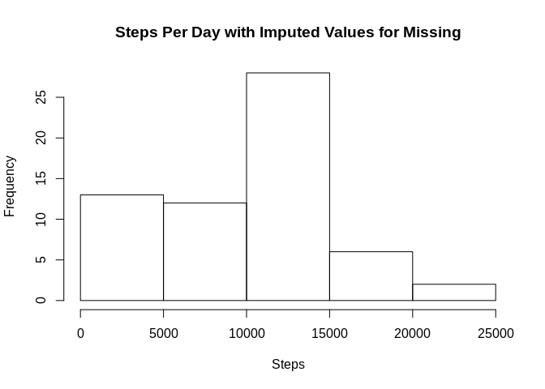
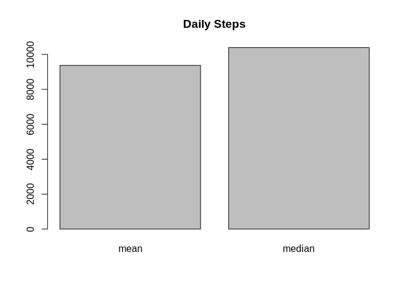
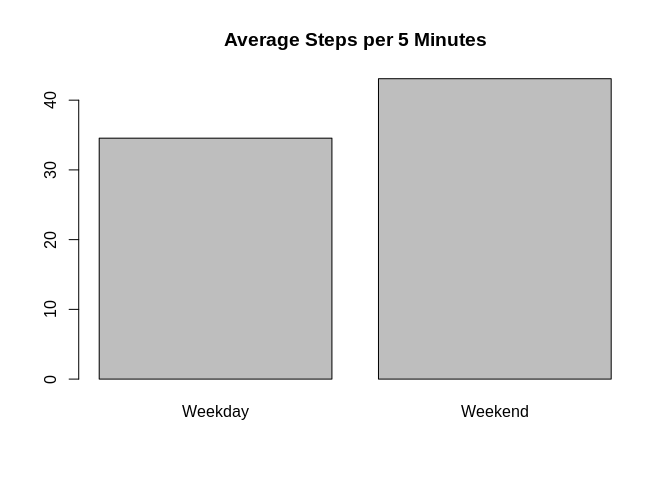
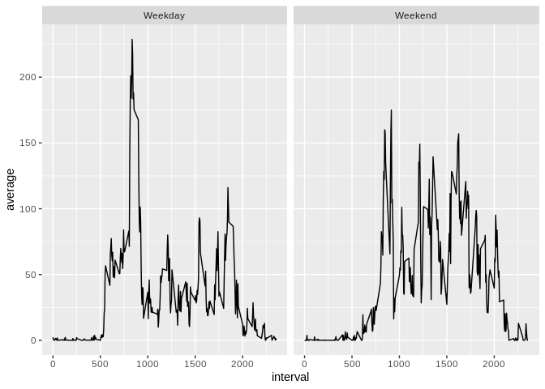

## Loading and preprocessing the data

Load the data, clean up the data types, and summarize by date.


```r
library(ggplot2)
library(lubridate)
```

```
## 
## Attaching package: 'lubridate'
```

```
## The following object is masked from 'package:base':
## 
##     date
```

```r
library(dplyr)
```

```
## 
## Attaching package: 'dplyr'
```

```
## The following objects are masked from 'package:lubridate':
## 
##     intersect, setdiff, union
```

```
## The following objects are masked from 'package:stats':
## 
##     filter, lag
```

```
## The following objects are masked from 'package:base':
## 
##     intersect, setdiff, setequal, union
```

```r
read.csv("activity.csv")->activity
activity$date<-ymd(activity$date)
activity%>%
  group_by(date)%>%
  summarize(steps=sum(steps,na.rm=TRUE))%>%
  filter(!is.nan(steps))->
  sumactivity
```

## How are the steps per day distributed?

Show a histogram of steps per day.


```r
hist(sumactivity$steps[!is.na(sumactivity$steps)],xlab='Steps',main='Steps per Day')
```

<!-- -->

## What is mean total number of steps taken per day?

Show the mean and median number of steps per day


```r
meanactivity=mean(sumactivity$steps)
medianactivity=median(sumactivity$steps)

c(meanactivity,medianactivity)->actavg
names(actavg)<-c('mean','median')

barplot(actavg,main='Daily Steps')
```

<!-- -->

## What is the average daily activity pattern?

Show a time series with the interval as the time.


```r
activity%>%group_by(interval)%>%
  summarize(avg=mean(steps,na.rm=TRUE))->dailyactivity

plot(dailyactivity, type='l',ylab='Average', main='Steps in 5 Minute Intervals')
```

<!-- -->

## Imputing missing values

Replace missing values with the median value for that time interval.

Because we used median values, the averages are not significantly different.


```r
activity%>%group_by(interval)%>%summarize(steps=median(steps,na.rm=TRUE))->meansteps


activity%>%mutate(
  steps=case_when(
    is.na(steps)~meansteps$steps[meansteps$interval==interval],
    TRUE~steps
    )
  )->activitynona


activitynona%>%
  group_by(date)%>%
  summarize(steps=sum(steps,na.rm=TRUE))%>%
  filter(!is.nan(steps))->
  sumactivitynona
hist(sumactivitynona$steps[!is.na(sumactivitynona$steps)], xlab='Steps',main='Steps Per Day with Imputed Values for Missing')
```

<!-- -->

```r
meanactivitynona=mean(sumactivitynona$steps)
medianactivitynona=median(sumactivitynona$steps)

c(meanactivitynona,medianactivitynona)->actavgnona
names(actavgnona)<-c('mean','median')

barplot(actavgnona,main='Daily Steps')
```

<!-- -->


## Are there differences in activity patterns between weekdays and weekends?

Show the mean and median per day as well as the pattern of activity through the day for weekends vs weekdays.


```r
c('Sun','Sat')->weekends
activitynona%>%mutate(weekend=weekdays(date,TRUE)%in%weekends)->activitynona
activitynona$days='Weekday'
activitynona$days[activitynona$weekend]='Weekend'
activitynona$days=factor(activitynona$days)
activitynona%>%group_by(days)%>%summarise(mean=mean(steps, na.rm=TRUE))->weekendStepsT

weekendSteps=weekendStepsT$mean
names(weekendSteps)=weekendStepsT$days


barplot(weekendSteps, main='Average Steps per 5 Minutes')
```

<!-- -->

```r
activitynona%>%group_by(interval, days)%>%
  summarize(average=mean(steps,na.rm=TRUE))->dailyactivity2

ggplot(dailyactivity2,aes(x=interval, y=average))+geom_line()+facet_grid(.~days)
```

<!-- -->
